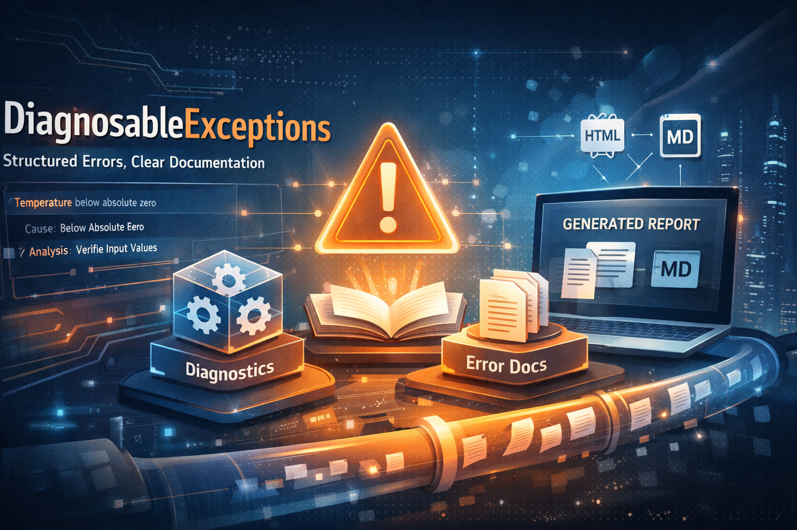

# Design Principles

DiagnosableExceptions is built on the idea that errors are not accidental by-products of code, but meaningful parts of the system’s knowledge. In many applications, errors are treated as technical noise — something to log, catch, or hide. This library takes the opposite stance: when an error is expressed, it reveals something about the rules, assumptions, and boundaries of the system.

An exception is not merely a failure of execution. It represents a situation that the system recognizes and gives a name to. By turning error situations into explicit concepts — through factory methods, codes, diagnostics, and documentation — the system becomes more readable, more explainable, and more supportable.

Another core principle is that documentation must not drift away from behavior. Traditional documentation lives in external files and slowly becomes outdated. Here, documentation is defined next to the code that creates the error. This proximity ensures that knowledge evolves with the system itself. If behavior changes, the documentation changes with it, because they share the same source.

Diagnostics are not post-mortem analysis; they are structured hypotheses. The goal is not to assign blame or determine root causes in advance, but to provide meaningful starting points for investigation. Errors describe what is known, not what is assumed.

The library also separates semantics from mechanics. Throwing, catching, logging, or transporting errors are mechanical concerns. The meaning of an error — what rule was violated, what situation occurred, what might explain it — belongs to the domain of knowledge. DiagnosableExceptions focuses on preserving that meaning, regardless of how the error travels through the system.

Finally, the design acknowledges that not every failure should be exceptional in the runtime sense. Some errors are expected parts of normal flow, such as validation failures or parsing issues. By allowing exceptions to be used as structured error information through `TryOutcome<T>`, the model supports both throwing and non-throwing flows without losing semantic richness.

In essence, the library encourages teams to treat errors as first-class knowledge artifacts. When errors are explicit, documented, and structured, they improve communication between developers, support teams, and the system itself.

---

Previous section: [Getting Started](GettingStarted.en.md) | Next section: [When Not to Use DiagnosableExceptions](WhenNotToUseDiagnosableExceptions.en.md)

---

