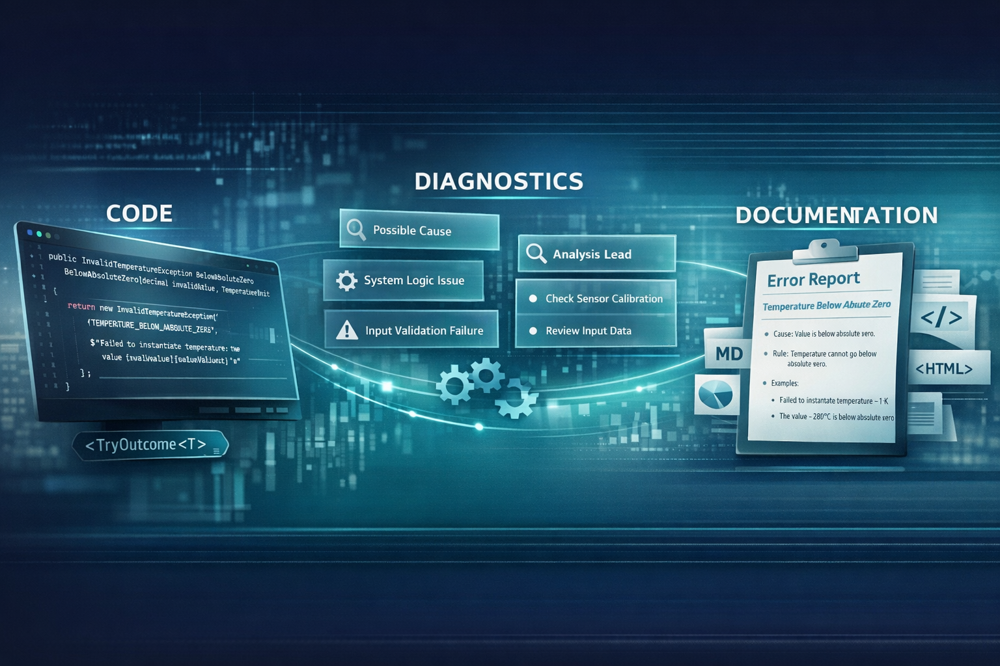

# DiagnosableExceptions

🌍 **Langues:**  
🇬🇧 [English](../README.md) | 🇫🇷 Français (ce fichier)

---

**Transformez vos exceptions en connaissance structurée et vivante sur votre système.**



DiagnosableExceptions est une bibliothèque .NET qui considère les erreurs comme des concepts de premier ordre, documentés et diagnostiquables — pas seulement comme des chaînes de caractères lancées à l’exécution.

Elle vous aide à :

* exprimer les erreurs de manière cohérente et structurée
* associer des diagnostics utiles à chaque erreur
* garder la documentation des erreurs proche du code
* générer automatiquement une documentation humaine des erreurs

## 🚨 Le problème

Dans la plupart des systèmes, les erreurs sont :

* dispersées dans le code
* décrites par des messages ad hoc
* peu ou pas documentées
* difficiles à analyser
* déconnectées du support et des opérations

Avec le temps, cela entraîne :

* des investigations répétées
* du savoir implicite (“tribal knowledge”)
* des équipes support qui devinent
* des développeurs qui réexpliquent sans cesse les mêmes erreurs

## 💡 L’idée

Et si :

> **Chaque erreur de votre système était explicitement décrite, structurée et documentée — directement dans le code — et que cette documentation pouvait être générée automatiquement ?**

DiagnosableExceptions introduit :

* un **modèle d’exception enrichi**
* un **système de diagnostics structurés**
* un **DSL pour documenter les erreurs**
* un **pipeline d’extraction de documentation**

Les erreurs deviennent :

> non seulement des échecs,
> mais des **unités de connaissance documentées**.

## 🧱 Ce que fournit la bibliothèque

### 1️⃣ Un modèle d’exception plus riche

Les exceptions portent :

* un code d’erreur stable
* un horodatage
* un message court et/ou détaillé
* des données de contexte
* des diagnostics structurés

Elles sont conçues pour être :

* loguées de manière cohérente
* comprises par des humains
* exploitées par des outils

### 2️⃣ Des diagnostics structurés

Chaque erreur peut déclarer des **causes possibles** et des **pistes d’analyse** :

* Qu’est-ce qui a pu provoquer cette erreur ?
* Est-elle plutôt liée aux données d’entrée, au système, ou aux deux ?
* Par où commencer l’investigation ?

Les diagnostics orientent l’analyse sans figer les processus opérationnels.

### 3️⃣ Un DSL pour décrire les erreurs

Les erreurs sont documentées directement dans le code via une API fluide :

```csharp
return DescribeError.WithTitle("Temperature below absolute zero")
                    .WithDescription("This error occurs when trying to instantiate a temperature with a value that is below absolute zero.")
                    .WithRule("Temperature cannot go below absolute zero because absolute zero is the point where particles have minimum possible energy.")
                    .WithDiagnostics(ValueObjectDiagnostic.Diagnostic)
                    .WithExamples(
                        () => BelowAbsoluteZero(-1, TemperatureUnit.Kelvin),
                        () => BelowAbsoluteZero(-280, TemperatureUnit.Celsius));
```

Il ne s’agit pas de simples commentaires — c’est de la **documentation structurée et exécutable**.

### 4️⃣ Extraction de la documentation

La bibliothèque fournit un mécanisme pour analyser les assemblies et extraire toute la documentation d’erreurs déclarée :

* liée aux types d’exceptions
* liée aux méthodes factory
* enrichie par des exemples
* prête à être rendue

Cela permet de générer :

* des catalogues d’erreurs en Markdown ou HTML
* de la documentation orientée support
* une documentation vivante générée depuis le code

## 🔁 Exception ou pas ? À vous de choisir.

La bibliothèque supporte à la fois :

* **les erreurs levées** (flux classique par exceptions)
* **les erreurs transportées sans être levées** via `TryOutcome<T>`

Cela vous permet d’utiliser les exceptions :

> comme signaux d’exécution
> ou comme données d’erreur structurées

selon le contexte (domaine, validation, pipelines, etc.).

## 🧩 Exemple

Extrait du projet `DiagnosableExceptions.Usage` :

```csharp
[ProvidesErrorsFor(typeof(Temperature))]
public sealed class InvalidTemperatureException : DomainException {

    [DocumentedBy(nameof(BelowAbsoluteZeroDocumentation))]
    internal static InvalidTemperatureException BelowAbsoluteZero(decimal invalidValue, TemperatureUnit invalidValueUnit) {
        return new InvalidTemperatureException(
            "TEMPERATURE_BELOW_ABSOLUTE_ZERO",
            $"Failed to instantiate temperature: the value {invalidValue}{invalidValueUnit} is below absolute zero.",
            "Temperature is below absolute zero.");
    }

    private static ErrorDocumentation BelowAbsoluteZeroDocumentation() {
        return DescribeError.WithTitle("Temperature below absolute zero")
                            .WithDescription("This error occurs when trying to instantiate a temperature with a value that is below absolute zero.")
                            .WithRule("Temperature cannot go below absolute zero because absolute zero is the point where particles have minimum possible energy.")
                            .WithDiagnostics(ValueObjectDiagnostic.Diagnostic)
                            .WithExamples(
                                () => BelowAbsoluteZero(-1, TemperatureUnit.Kelvin),
                                () => BelowAbsoluteZero(-280, TemperatureUnit.Celsius));
    }
}
```

Ici, l’exception, sa signification, sa règle, ses diagnostics et des exemples de messages sont définis ensemble — dans le code.

## 🎯 Pour qui ?

DiagnosableExceptions est particulièrement utile si :

* vous développez des systèmes métiers complexes
* vous vous souciez de la supportabilité
* vous voulez une gestion d’erreurs cohérente
* vous souhaitez une documentation qui ne dérive pas du code
* vous concevez avec une approche orientée domaine

## 📚 Étapes suivantes

Consultez le projet **DiagnosableExceptions.Usage** dans ce dépôt pour des exemples concrets.

Des outils plus avancés (génération de documentation, exporters, CLI) peuvent être construits au-dessus du modèle structuré fourni par cette bibliothèque.
